     1	<!-- ═══════════════════════════════════════════════════════════════════════════════
     2	     M O T I O N M A S T E R   P R O  ·  README v2.0.0
     3	     Dual-Engine AI Video Synthesis Platform
     4	     ═══════════════════════════════════════════════════════════════════════════════ -->
     5	
     6	<div align="center">
     7	
     8	<!-- Animated SVG Header -->
     9	
    10	
    11	<br>
    12	
    13	### **Dual-Engine AI Video Synthesis · Storyboard-to-Cinema Pipeline · Real-time Voiceover**
    14	*Production-grade · GPU-Optimized · Gradio-Powered · L4/A100 Ready*
    15	
    16	---
    17	
    18	<!-- ─── BADGE ECOSYSTEM ─── -->
    19	
    20	
    21	
    22	
    23	
    24	
    25	
    26	
    27	
    28	
    29	
    30	[](https://colab.research.google.com/)
    31	
    32	
    33	
    34	
    35	---
    36	
    37	> **MotionMaster Pro** is a production-grade, dual-engine AI video synthesis platform combining
    38	> **I2VGenXL** image-to-video diffusion with **Stable Diffusion XL** cinematic frame generation.
    39	> Automated prompt engineering, OpenCV post-processing, gTTS voiceover, and a complete
    40	> storyboard-to-MP4 pipeline — all inside a single Gradio session on a 24 GB L4 GPU.
    41	
    42	---
    43	
    44	[🚀 Quick Start](#-quick-start-60-seconds) · [🧠 Architecture](#-system-architecture) · [📖 API Reference](#-api-reference) · [🎬 Usage Guide](#-usage-guide) · [🗺️ Roadmap](#%EF%B8%8F-roadmap) · [🤝 Contributing](#-contributing)
    45	
    46	</div>
    47	
    48	---
    49	
    50	
    51	<details>
    52	<summary><strong>Click to expand full contents</strong></summary>
    53	
    54	1. [System Overview](#-system-overview)
    55	2. [Feature Matrix](#-feature-matrix)
    56	3. [System Architecture](#-system-architecture)
    57	   - [High-Level Platform Diagram](#high-level-platform-diagram)
    58	   - [Pipeline A — I2VGenXL Image-to-Video](#pipeline-a--i2vgenxl-image-to-video)
    59	   - [Pipeline B — SDXL Cinematic Video](#pipeline-b--sdxl-cinematic-video)
    60	   - [Audio Synthesis Pipeline](#audio-synthesis-pipeline)
    61	4. [AI Model Registry](#-ai-model-registry)
    62	5. [Performance Benchmarks](#-performance-benchmarks)
    63	6. [Hardware Requirements](#-hardware-requirements)
    64	7. [Quick Start (60 Seconds)](#-quick-start-60-seconds)
    65	8. [Full Installation](#-full-installation)
    66	9. [Configuration Reference](#-configuration-reference)
    67	10. [Usage Guide](#-usage-guide)
    68	    - [Mode 1: Single Image to Video](#mode-1-single-image-to-video-i2vgenxl)
    69	    - [Mode 2: Cinematic Storyboard Video](#mode-2-cinematic-storyboard-video-sdxl)
    70	    - [Mode 3: Batch Processing](#mode-3-batch-processing)
    71	11. [Storyboard Format Specification](#-storyboard-format-specification)
    72	12. [Video Effects Technical Reference](#-video-effects-technical-reference)
    73	13. [API Reference](#-api-reference)
    74	14. [GPU Optimization Guide](#-gpu-optimization-guide)
    75	15. [Error Codes & Troubleshooting](#-error-codes--troubleshooting)
    76	16. [Known Limitations](#-known-limitations)
    77	17. [Changelog](#-changelog)
    78	18. [Roadmap](#%EF%B8%8F-roadmap)
    79	19. [Contributing](#-contributing)
    80	20. [Citation](#-citation)
    81	21. [License & Acknowledgements](#-license--acknowledgements)
    82	
    83	</details>
    84	
    85	---
    86	
    87	## 🌐 System Overview
    88	
    89	MotionMaster Pro orchestrates **three independent Hugging Face models** through two parallel synthesis pipelines, a GPU memory management layer, and a multi-stage audio-video assembly chain — all exposed through a zero-configuration Gradio 4.x interface.
    90	
    91	| Metric | Value |
    92	|--------|-------|
    93	| **AI Models** | 3 (I2VGenXL · SDXL Base 1.0 · GIT-Base-COCO) |
    94	| **Inference Precision** | FP16 on CUDA · FP32 fallback on CPU |
    95	| **Max Resolution** | 768 × 768 px per frame |
    96	| **Max Video Duration** | ~60 seconds (cinematic mode) |
    97	| **Audio Tracks** | Voiceover + Background Music (CompositeAudioClip) |
    98	| **Export Formats** | GIF · MP4 (H.264 + AAC) |
    99	| **Post-Processing Effects** | Vintage · Dream · Cinematic |
   100	| **Target Hardware** | Google Colab L4 (24 GB) · A100 · RTX 3090+ |
   101	| **Interface** | Gradio 4.x (3-tab layout, share-link enabled) |
   102	| **Minimum VRAM** | 12 GB (FP16) · 24 GB recommended |
   103	
   104	---
   105	
   106	## ✅ Feature Matrix
   107	
   108	| Feature | Pipeline A (I2VGenXL) | Pipeline B (SDXL Cinematic) |
   109	|---|:---:|:---:|
   110	| Image → Animated Video | ✅ | ❌ |
   111	| Storyboard → Cinema | ❌ | ✅ |
   112	| Auto Prompt Generation (GIT captioning) | ✅ | ❌ |
   113	| Batch Processing (N images) | ✅ | ❌ |
   114	| Voiceover (gTTS) | ❌ | ✅ |
   115	| Background Music | ❌ | ✅ |
   116	| Per-scene GIF Assembly | ❌ | ✅ |
   117	| MP4 Export (H.264) | ✅ | ✅ |
   118	| GIF Export | ✅ | ❌ |
   119	| Vintage Effect (Sepia + Film Grain) | ✅ | ❌ |
   120	| Dream Effect (Gaussian Glow) | ✅ | ❌ |
   121	| Cinematic Effect (Letterbox + Grade) | ✅ | ❌ |
   122	| Seed Control & Reproducibility | ✅ | ✅ |
   123	| CUDA Memory Management | ✅ | ✅ |
   124	| LRU Pipeline Caching | ✅ | ❌ |
   125	| CPU Offloading | ✅ | ❌ |
   126	| Attention Slicing | ❌ | ✅ |
   127	| Analytics Dashboard | ✅ | ❌ |
   128	| User Gallery | ✅ | ❌ |
   129	| URL Image Input | ✅ | ❌ |
   130	
   131	---
   132	
   133	## 🧠 System Architecture
   134	
   135	### High-Level Platform Diagram
   136	
   137	```mermaid
   138	graph TB
   139	    subgraph UI["🖥️  Gradio Interface — 3 Tabs"]
   140	        T1["Tab 1\nImage → Video\n(I2VGenXL)"]
   141	        T2["Tab 2\nBatch Processing"]
   142	        T3["Tab 3\nCinematic Generator\n(SDXL)"]
   143	        T4["Tab 4\nGallery & Analytics"]
   144	    end
   145	
   146	    subgraph INGEST["📥  Input Layer"]
   147	        A1["PIL Image Upload"]
   148	        A2["Image URL\n(requests stream)"]
   149	        A3["Storyboard .txt File"]
   150	        A4["Batch Image Array"]
   151	    end
   152	
   153	    subgraph PA["🎬  Pipeline A — I2VGenXL"]
   154	        direction TB
   155	        PA1["GIT-Base-COCO\nImage Captioner"]
   156	        PA2["Prompt Augmenter\n5 motion variants"]
   157	        PA3["I2VGenXL\nali-vilab/i2vgen-xl\nFP16 · CPU Offload"]
   158	        PA4["Frame Buffer\n16–25 frames @ 25 steps"]
   159	        PA1 --> PA2 --> PA3 --> PA4
   160	    end
   161	
   162	    subgraph PB["🎥  Pipeline B — SDXL Cinematic"]
   163	        direction TB
   164	        PB1["Storyboard Parser\n---  delimited"]
   165	        PB2["Scene Scheduler\n5 scenes × 12s"]
   166	        PB3["SDXL Base 1.0\nstabilityai/stable-diffusion-xl-base-1.0\nFP16 · DPMSolver · 768px"]
   167	        PB4["Frame Enhancer\nSharpness ×1.5 · Contrast ×1.2"]
   168	        PB5["GIF Assembly\nimageio · 12 fps"]
   169	        PB1 --> PB2 --> PB3 --> PB4 --> PB5
   170	    end
   171	
   172	    subgraph POST["✨  Post-Processing Engine"]
   173	        PP1{"Effect\nSelector"}
   174	        PP2["Vintage\nSepia Kernel + Film Grain"]
   175	        PP3["Dream\nGaussian Glow + HSV Sat."]
   176	        PP4["Cinematic\nLetterbox + AbsAlpha Grade"]
   177	        PP5["Pass-Through\n(none)"]
   178	        PP1 --> PP2 & PP3 & PP4 & PP5
   179	    end
   180	
   181	    subgraph AUDIO["🔊  Audio Synthesis"]
   182	        AU1["gTTS Voiceover\nper-scene narration\n12s clips · fade in/out"]
   183	        AU2["BenSound Music\n5 moods · 192k MP3"]
   184	        AU3["Pydub Mixer\nNormalize · Gain +5dB"]
   185	        AU4["CompositeAudioClip\nVoice ×1.5 · Music ×0.4"]
   186	        AU1 --> AU3
   187	        AU2 --> AU3
   188	        AU3 --> AU4
   189	    end
   190	
   191	    subgraph ASSEMBLE["🎞️  Assembly & Export"]
   192	        AS1["MoviePy Concatenator\nCompose method"]
   193	        AS2["ffmpeg libx264\nAAC audio · H.264"]
   194	        AS3["GIF Exporter\ndiffusers export_to_gif"]
   195	        AS4["MP4 Output\n/content/outputs/"]
   196	        AS5["GIF Output\n/content/user_gallery/"]
   197	        AS1 --> AS2 --> AS4
   198	        AS3 --> AS5
   199	    end
   200	
   201	    subgraph MEM["⚙️  Memory Manager"]
   202	        M1["CUDA Cache Clear\ntorch.cuda.empty_cache()"]
   203	        M2["GC Collect\ngc.collect()"]
   204	        M3["LRU Cache\nmaxsize=1 pipelines"]
   205	        M4["Attention Slicing\nSDXL only"]
   206	    end
   207	
   208	    UI --> INGEST
   209	    INGEST --> PA & PB
   210	    PA4 --> POST
   211	    PB5 --> ASSEMBLE
   212	    POST --> ASSEMBLE
   213	    PB --> AUDIO --> ASSEMBLE
   214	    ASSEMBLE -.->|post-generation| MEM
   215	```
   216	
   217	---
   218	
   219	### Pipeline A — I2VGenXL Image-to-Video
   220	
   221	```mermaid
   222	sequenceDiagram
   223	    actor User
   224	    participant GR as Gradio UI
   225	    participant CAP as GIT-Base-COCO<br/>Captioner
   226	    participant I2V as I2VGenXL<br/>(FP16 + CPU Offload)
   227	    participant FX as OpenCV<br/>Effect Engine
   228	    participant EXP as Export<br/>Engine
   229	    participant FS as Filesystem<br/>/content/outputs/
   230	
   231	    User->>GR: Upload image + enter prompt
   232	    GR->>CAP: pixel_values (processor)
   233	    CAP-->>GR: base_caption (max_length=50)
   234	    GR->>GR: Augment → 5 motion variants
   235	    User->>GR: Select prompt + settings
   236	    GR->>I2V: image, prompt, neg_prompt<br/>steps, guidance, generator(seed)
   237	    Note over I2V: FP16 inference<br/>CPU offload active<br/>~25 denoising steps
   238	    I2V-->>GR: frames[0] (List[PIL])
   239	    GR->>FX: frames + effect_type + intensity
   240	    Note over FX: RGB→BGR→effect→RGB<br/>per-frame OpenCV ops
   241	    FX-->>GR: processed_frames (List[PIL])
   242	    alt export_format == "gif"
   243	        GR->>EXP: export_to_gif(frames, path)
   244	    else export_format == "mp4"
   245	        GR->>EXP: frames_to_mp4(frames, path, fps=15)
   246	        Note over EXP: ImageSequenceClip<br/>libx264 codec
   247	    end
   248	    EXP->>FS: Write /content/outputs/i2v_output_{uid}_{ts}.{ext}
   249	    EXP->>FS: Mirror to /content/user_gallery/
   250	    GR-->>User: video_path + status_message
   251	```
   252	
   253	---
   254	
   255	### Pipeline B — SDXL Cinematic Video
   256	
   257	```mermaid
   258	flowchart LR
   259	    A["📄 Storyboard .txt"] --> B["Scene Parser\n--- delimiter"]
   260	    B --> C{5 Scenes\nExtracted?}
   261	    C -- No --> D["Auto-fill\nDefault scenes"]
   262	    C -- Yes --> E["Scene Scheduler"]
   263	    D --> E
   264	
   265	    E --> F["gTTS Voiceover\nper-scene 12s"]
   266	    E --> G["BenSound Music\nMood-matched MP3"]
   267	
   268	    E --> H["SDXL Loop\n5 × 12 frames"]
   269	    H --> I["Prompt Augmentation\n'frame N of 12, subtle motion'"]
   270	    I --> J["SDXL Base 1.0\n768×768 FP16\nDPMSolverMultistep"]
   271	    J --> K["PIL Enhance\nSharpness 1.5×\nContrast 1.2×"]
   272	    K --> L["imageio.mimsave\n.gif per scene"]
   273	
   274	    L --> M["MoviePy\nconcat_videoclips\ncompose method"]
   275	    F --> N["Pydub\nNormalize + Gain +5dB\nFade in/out 300ms"]
   276	    G --> N
   277	    N --> O["CompositeAudioClip\nVoice vol ×1.5\nMusic vol ×0.4"]
   278	
   279	    M --> P["VideoFileClip\n+ set_audio()"]
   280	    O --> P
   281	    P --> Q["ffmpeg write\nlibx264 + aac\n12 fps"]
   282	    Q --> R["🎬 Final MP4\n~60 seconds"]
   283	```
   284	
   285	---
   286	
   287	### Audio Synthesis Pipeline
   288	
   289	```mermaid
   290	graph TD
   291	    A["Scene Prompts\n(Image: field text)"] --> B["gTTS Engine\nlang=en · slow=False\nspeedup ×1.05"]
   292	    B --> C["Per-scene AudioSegment\n12,000ms target"]
   293	    C --> D{"duration\n== 12s?"}
   294	    D -- "> 12s" --> E["Truncate\naudio[:12000]"]
   295	    D -- "< 12s" --> F["Pad Silent\nAudioSegment.silent()"]
   296	    D -- "== 12s" --> G
   297	    E --> G["Fade In 300ms\nFade Out 300ms"]
   298	    F --> G
   299	    G --> H["Concatenate\n5 scene clips"]
   300	    H --> I["Normalize\n+ Apply Gain +5dB"]
   301	    I --> J["Export MP3\nbitrate=192k"]
   302	
   303	    K["Music Mood\ncinematic/dramatic\nupbeat/suspense\nemotional"] --> L["BenSound URL Fetch\nrequests.get()"]
   304	    L --> M["AudioSegment\n60,000ms clip\nNormalize · Gain -8dB"]
   305	    M --> N["Export Background\n192k MP3"]
   306	
   307	    J --> O["CompositeAudioClip\n[ voiceover ×1.5, music ×0.4 ]"]
   308	    N --> O
   309	    O --> P["Video.set_audio()\nfinal mux"]
   310	```
   311	
   312	---
   313	
   314	## 🤖 AI Model Registry
   315	
   316	| Model ID | Provider | Task | Parameters | Precision | Memory (VRAM) | Cache Strategy |
   317	|---|---|---|---|---|---|---|
   318	| `ali-vilab/i2vgen-xl` | Alibaba DAMO | Image → Video Diffusion | ~3.4 B | FP16 | ~9 GB | `@lru_cache(maxsize=1)` + CPU offload |
   319	| `stabilityai/stable-diffusion-xl-base-1.0` | Stability AI | Text → Image (frame gen) | ~3.5 B | FP16 | ~12 GB | Preloaded at startup + attention slicing |
   320	| `microsoft/git-base-coco` | Microsoft | Image Captioning | ~182 M | FP32 | ~0.7 GB | `@lru_cache(maxsize=1)` |
   321	
   322	### Model Loading Strategy
   323	
   324	```
   325	Startup:
   326	  └── preload_model()
   327	        └── SDXL Base 1.0  ──► DPMSolverMultistepScheduler
   328	              └── .to("cuda") + enable_attention_slicing()
   329	              └── Test generation: 768×768, 25 steps → /content/temp/test_image.png
   330	              └── model_loaded = True
   331	
   332	On-demand (lazy, LRU-cached):
   333	  └── load_pipeline()    → I2VGenXL  (first call only)
   334	  └── load_captioning_model() → GIT-Base-COCO (first call only)
   335	
   336	After each inference:
   337	  └── clear_cuda_memory()
   338	        └── torch.cuda.empty_cache()
   339	        └── gc.collect()
   340	        └── LOG: CUDA usage in GB
   341	```
   342	
   343	---
   344	
   345	## 📊 Performance Benchmarks
   346	
   347	> Measured on **Google Colab L4 GPU (24 GB VRAM, 56 TFLOPS FP16)**
   348	
   349	### Pipeline A — I2VGenXL
   350	
   351	| Configuration | Steps | Guidance | Time (s) | VRAM Peak | Frames |
   352	|---|---|---|---|---|---|
   353	| Fast | 10 | 7.5 | ~45 s | ~9.5 GB | 16 |
   354	| Balanced *(default)* | 25 | 9.0 | ~110 s | ~10.2 GB | 16 |
   355	| Quality | 50 | 9.0 | ~215 s | ~10.8 GB | 16 |
   356	
   357	### Pipeline B — SDXL Cinematic (5 scenes × 12 frames)
   358	
   359	| Configuration | Steps/Frame | Resolution | Time per Scene | Total Time | VRAM Peak |
   360	|---|---|---|---|---|---|
   361	| Draft | 10 | 768×768 | ~25 s | ~3 min | ~12 GB |
   362	| Standard *(default)* | 25 | 768×768 | ~60 s | ~5–6 min | ~14 GB |
   363	| High Quality | 50 | 768×768 | ~115 s | ~11 min | ~15 GB |
   364	
   365	### OpenCV Effect Processing
   366	
   367	| Effect | Avg Time per Frame | Ops |
   368	|---|---|---|
   369	| `none` | < 1 ms | Pass-through |
   370	| `vintage` | ~4 ms | `cv2.transform` (sepia) + `addWeighted` + noise |
   371	| `dream` | ~6 ms | `GaussianBlur` + `addWeighted` + HSV sat. boost |
   372	| `cinematic` | ~3 ms | letterbox mask + `convertScaleAbs` |
   373	
   374	---
   375	
   376	## 💻 Hardware Requirements
   377	
   378	| Tier | GPU | VRAM | RAM | Status |
   379	|---|---|---|---|---|
   380	| 🥇 **Recommended** | NVIDIA L4 / A100 | 24 GB | 16 GB+ | Fully supported |
   381	| 🥈 **Supported** | RTX 3090 / RTX 4080 | 24 GB / 16 GB | 16 GB | Fully supported |
   382	| 🥉 **Minimal** | RTX 3070 / T4 | 12 GB | 12 GB | Pipeline A only; reduce steps |
   383	| ⚠️ **CPU Only** | Any | — | 32 GB+ | Pipeline A in FP32; very slow (~20 min) |
   384	
   385	### Software Prerequisites
   386	
   387	| Dependency | Version | Notes |
   388	|---|---|---|
   389	| Python | ≥ 3.10 | 3.11 recommended |
   390	| CUDA Toolkit | ≥ 11.8 | Auto-detected |
   391	| PyTorch | ≥ 2.0 | `+cu118` or `+cu121` |
   392	| `diffusers` | ≥ 0.25 | HuggingFace |
   393	| `transformers` | ≥ 4.37 | HuggingFace |
   394	| `gradio` | ≥ 4.x | UI framework |
   395	| `moviepy` | ≥ 1.0.3 | Video assembly |
   396	| `pydub` | ≥ 0.25 | Audio processing |
   397	| `gTTS` | ≥ 2.5 | Voiceover synthesis |
   398	| `imageio` | ≥ 2.33 | GIF creation |
   399	| `opencv-python` | ≥ 4.8 | Effect processing |
   400	| `ffmpeg` | system package | Codec backend |
   401	| `espeak` | system package | Required by gTTS on Linux |
   402	| `accelerate` | ≥ 0.27 | `enable_model_cpu_offload` |
   403	
   404	---
   405	
   406	## 🚀 Quick Start (60 Seconds)
   407	
   408	**Step 1 — Open the notebook in Colab**
   409	
   410	[](https://colab.research.google.com/)
   411	
   412	> ⚡ Ensure **Runtime → Change runtime type → L4 GPU** is selected before running.
   413	
   414	**Step 2 — Run all cells**
   415	
   416	```bash
   417	# All install cells run automatically — the final cell launches the Gradio app.
   418	# You will see a public share link:
   419	# Running on public URL: https://xxxx.gradio.live
   420	```
   421	
   422	**Step 3 — Choose your mode**
   423	
   424	| Tab | What to do |
   425	|---|---|
   426	| **Image → Video (I2VGenXL)** | Upload an image, enter a motion prompt, hit 🚀 Generate |
   427	| **Cinematic Video Generator** | Upload a `.txt` storyboard, choose music mood, hit Generate |
   428	| **Batch Processing** | Upload N images, enter N prompts (one per line), run batch |
   429	
   430	---
   431	
   432	## 📦 Full Installation
   433	
   434	### Option A — Google Colab (Recommended)
   435	
   436	```python
   437	# Cell 1 — System packages
   438	!apt-get update -qq
   439	!apt-get install -y ffmpeg espeak -qq
   440	
   441	# Cell 2 — Python packages
   442	!pip install -q \
   443	    torch torchvision --index-url https://download.pytorch.org/whl/cu121 \
   444	    diffusers==0.25.1 \
   445	    transformers==4.37.2 \
   446	    accelerate==0.27.0 \
   447	    gradio==4.19.2 \
   448	    moviepy==1.0.3 \
   449	    pydub==0.25.1 \
   450	    gTTS==2.5.1 \
   451	    imageio==2.33.1 \
   452	    opencv-python==4.9.0.80 \
   453	    Pillow==10.2.0 \
   454	    sentencepiece \
   455	    soundfile \
   456	    librosa \
   457	    ffmpeg-python
   458	
   459	# Cell 3 — Clone repo
   460	!git clone https://github.com/yourname/motionmaster-pro
   461	%cd motionmaster-pro
   462	
   463	# Cell 4 — Launch
   464	!python app.py
   465	```
   466	
   467	### Option B — Local Installation
   468	
   469	```bash
   470	# 1. Clone repository
   471	git clone https://github.com/yourname/motionmaster-pro.git
   472	cd motionmaster-pro
   473	
   474	# 2. Create virtual environment
   475	python -m venv .venv
   476	source .venv/bin/activate          # Linux/macOS
   477	# .\.venv\Scripts\activate         # Windows
   478	
   479	# 3. Install CUDA-enabled PyTorch first
   480	pip install torch torchvision --index-url https://download.pytorch.org/whl/cu121
   481	
   482	# 4. Install all requirements
   483	pip install -r requirements.txt
   484	
   485	# 5. Install system packages (Linux)
   486	sudo apt-get install ffmpeg espeak -y
   487	
   488	# 6. Launch
   489	python app.py
   490	```
   491	
   492	### `requirements.txt`
   493	
   494	```
   495	torch>=2.0.0
   496	torchvision>=0.15.0
   497	diffusers>=0.25.0
   498	transformers>=4.37.0
   499	accelerate>=0.27.0
   500	gradio>=4.19.0
   501	moviepy==1.0.3
   502	pydub>=0.25.1
   503	gTTS>=2.5.0
   504	imageio>=2.33.0
   505	opencv-python>=4.8.0
   506	Pillow>=10.0.0
   507	requests>=2.31.0
   508	numpy>=1.24.0
   509	matplotlib>=3.7.0
   510	sentencepiece
   511	soundfile
   512	librosa
   513	ffmpeg-python
   514	tqdm
   515	```
   516	
   517	---
   518	
   519	## ⚙️ Configuration Reference
   520	
   521	All tunable parameters are exposed via the Gradio UI sliders. The table below documents every parameter, its data type, valid range, default, and internal effect.
   522	
   523	### Pipeline A Parameters
   524	
   525	| Parameter | UI Label | Type | Default | Range | Effect |
   526	|---|---|---|---|---|---|
   527	| `num_inference_steps` | Inference Steps | `int` | `25` | 10–50 | Denoising step count; higher = sharper, slower |
   528	| `guidance_scale` | Guidance Scale | `float` | `9.0` | 1.0–15.0 | CFG scale; higher = more prompt-faithful |
   529	| `seed` | Seed | `int` | `-1` (random) | -1–2147483647 | `-1` uses `torch.manual_seed(time())` |
   530	| `effect_type` | Effect Type | `str` | `"none"` | none/vintage/dream/cinematic | OpenCV post-processing mode |
   531	| `effect_intensity` | Effect Intensity | `float` | `0.5` | 0.0–1.0 | Blending weight for chosen effect |
   532	| `export_format` | Export Format | `str` | `"gif"` | gif/mp4 | Output container format |
   533	
   534	### Pipeline B Parameters
   535	
   536	| Parameter | UI Label | Type | Default | Range | Effect |
   537	|---|---|---|---|---|---|
   538	| `num_inference_steps` | Inference Steps | `int` | `25` | 10–50 | Per-frame SDXL steps |
   539	| `guidance_scale` | Guidance Scale | `float` | `7.5` | 1.0–15.0 | CFG scale for SDXL |
   540	| `seed` | Seed | `int` | `-1` | -1–2147483647 | Shared seed across all scene frames |
   541	| `music_mood` | Music Mood | `str` | `"cinematic"` | cinematic/dramatic/upbeat/suspense/emotional | BenSound track selector |
   542	| `negative_prompt` | Negative Prompt | `str` | see below | — | Concepts to suppress in SDXL generation |
   543	
   544	**Default Negative Prompt (Pipeline A)**
   545	```
   546	Distorted, discontinuous, ugly, blurry, low resolution, motionless, static,
   547	disfigured, disconnected limbs, ugly faces, incomplete arms
   548	```
   549	
   550	**Default Negative Prompt (Pipeline B)**
   551	```
   552	blurry, bad quality, deformed, ugly, low resolution, cartoonish, abstract
   553	```
   554	
   555	---
   556	
   557	## 📖 Usage Guide
   558	
   559	### Mode 1: Single Image to Video (I2VGenXL)
   560	
   561	```
   562	1. Open the "Image to Video (I2VGenXL)" tab
   563	2. Upload your image (drag & drop or file dialog)
   564	   - Alternatively: paste an image URL into the URL field
   565	3. (Optional) Click "👁️ Generate Prompt Suggestions"
   566	   → GIT-Base-COCO captions your image and produces 5 motion-variant suggestions
   567	4. Enter or select a motion prompt
   568	5. Expand "Advanced Settings" to tune steps, guidance, and seed
   569	6. Choose Effect Type and Intensity
   570	7. Select Export Format (GIF for quick preview, MP4 for production)
   571	8. Click "🚀 Generate Video"
   572	9. Download from the output panel or browse the Gallery tab
   573	```
   574	
   575	**Example Prompts that Work Well**
   576	
   577	```
   578	"Leaves gently rustling in a warm summer breeze from left to right"
   579	"Ocean waves cascading rhythmically onto the shore at golden hour"
   580	"Snow falling softly in slow motion through a quiet pine forest"
   581	"Smoke curling upward from a campfire in a cinematic wide shot"
   582	"Clouds drifting slowly across a violet sunset sky"
   583	```
   584	
   585	---
   586	
   587	### Mode 2: Cinematic Storyboard Video (SDXL)
   588	
   589	```
   590	1. Create a storyboard .txt file (see format spec below)
   591	2. Open the "Cinematic Video Generator (SDXL)" tab
   592	3. Upload the .txt file
   593	4. Set negative prompt, inference steps, guidance scale, seed, music mood
   594	5. Click "Generate 1-Minute Video"
   595	6. Pipeline runtime: ~5–6 minutes on L4 GPU
   596	7. Download from /content/outputs/ or the output panel
   597	```
   598	
   599	**What happens internally (annotated):**
   600	
   601	```
   602	STARTUP           → preload_model() runs SDXL test generation at init
   603	PARSE             → parse_storyboard() splits on --- or \n\n, extracts
   604	                     Scene N, Image: prompt fields, fills 5 scenes
   605	VOICEOVER         → generate_voiceover() → gTTS per scene → 12s clips
   606	                     → Pydub concat → normalize → +5dB gain → 192k MP3
   607	BACKGROUND MUSIC  → generate_background_music(mood) → BenSound CDN fetch
   608	                     → normalize → -8dB → 192k MP3
   609	FRAME GEN LOOP    → for scene in scenes[0:5]:
   610	                       → generate_gif_frames() → 12 SDXL inferences
   611	                       → ImageEnhance (Sharpness 1.5×, Contrast 1.2×)
   612	                       → create_scene_gif() → imageio.mimsave()
   613	CONCAT            → concatenate_gifs_to_video() → MoviePy compose
   614	MUX               → add_audio_to_video() → CompositeAudioClip mux
   615	CLEANUP           → remove temp GIFs, audio, intermediate video
   616	OUTPUT            → /content/outputs/video_{YYYYMMDD_HHMMSS}.mp4
   617	```
   618	
   619	---
   620	
   621	### Mode 3: Batch Processing
   622	
   623	```
   624	1. Open the "Batch Processing" tab
   625	2. Upload N images via the file uploader
   626	3. Enter N prompts in the text box — one prompt per line
   627	   (Prompt count MUST equal image count — validated at runtime)
   628	4. Expand "Batch Settings" to configure shared effect settings
   629	5. Click "🔄 Process Batch"
   630	6. Monitor per-image progress in the status output
   631	7. Download all results from the gallery
   632	```
   633	
   634	**Important:** Batch mode runs `generate_video()` sequentially per image.  
   635	For large batches on Colab, set `seed != -1` to use incrementing seeds per image:  
   636	`seed_for_image_i = seed + i`
   637	
   638	---
   639	
   640	## 📄 Storyboard Format Specification
   641	
   642	### Grammar (EBNF)
   643	
   644	```ebnf
   645	storyboard   ::= scene { separator scene }
   646	separator    ::= "---" | blank-line blank-line
   647	scene        ::= header newline { field }
   648	header       ::= "Scene" whitespace integer ":" text
   649	field        ::= (image-field | description-field | narration-field)
   650	image-field  ::= ("Image:" | "Prompt:") whitespace text newline
   651	description-field ::= text newline
   652	```
   653	
   654	### Canonical Format (Recommended)
   655	
   656	```
   657	Scene 1: Opening — The Ancient Forest
   658	Image: Dense ancient redwood forest at dawn, golden shafts of light piercing through towering trees, photorealistic, ultra-detailed, 4K, cinematic
   659	
   660	---
   661	
   662	Scene 2: The River
   663	Image: Crystal-clear mountain river flowing over smooth stones, shallow depth of field, moss-covered banks, atmospheric mist, ultra-detailed, cinematic
   664	
   665	---
   666	
   667	Scene 3: The Village
   668	Image: Medieval stone village at twilight, warm candlelit windows, cobblestone streets glistening after rain, photorealistic, ultra-detailed
   669	
   670	---
   671	
   672	Scene 4: The Storm
   673	Image: Dramatic storm clouds forming over a vast open plain, lightning strikes in the distance, golden hour light breaking through, cinematic, ultra-detailed
   674	
   675	---
   676	
   677	Scene 5: Resolution — Sunrise
   678	Image: Sweeping aerial view of misty mountain valleys at sunrise, layers of fog, warm amber light, photorealistic, ultra-detailed, 4K
   679	```
   680	
   681	### Prompt Engineering Tips for SDXL
   682	
   683	Append these quality tokens to every `Image:` field for best results:
   684	
   685	```
   686	Essential:   photorealistic, ultra-detailed, cinematic lighting
   687	Quality:     4K, sharp focus, masterpiece
   688	Style:       (choose one) dramatic · atmospheric · ethereal · moody · epic
   689	Camera:      wide angle · close-up · aerial view · tracking shot
   690	Lighting:    golden hour · soft diffused · volumetric light · rim light
   691	```
   692	
   693	---
   694	
   695	## 🎨 Video Effects Technical Reference
   696	
   697	All effects are applied in `apply_video_effects(frames, effect_type, intensity)`.  
   698	Each frame is processed: `PIL → numpy (BGR) → OpenCV ops → PIL (RGB)`.
   699	
   700	### `vintage` — Sepia + Film Grain
   701	
   702	```python
   703	# Sepia transform via 3×3 color matrix
   704	sepia_kernel = np.array([
   705	    [0.393, 0.769, 0.189],
   706	    [0.349, 0.686, 0.168],
   707	    [0.272, 0.534, 0.131]
   708	])
   709	sepia_img = cv2.transform(img, sepia_kernel)
   710	img = cv2.addWeighted(img, 1 - intensity, sepia_img, intensity, 0)
   711	
   712	# Film grain — uniform random noise [0, 50]
   713	noise = np.random.randint(0, 50, img.shape, dtype=np.uint8)
   714	img = cv2.addWeighted(img, 0.9, noise, 0.1, 0)
   715	```
   716	
   717	| `intensity` | Sepia Blend | Original Blend | Grain |
   718	|---|---|---|---|
   719	| 0.0 | 0% | 100% | 10% always |
   720	| 0.5 | 50% | 50% | 10% always |
   721	| 1.0 | 100% | 0% | 10% always |
   722	
   723	---
   724	
   725	### `dream` — Gaussian Glow + Saturation Boost
   726	
   727	```python
   728	# Glow via Gaussian blur blend
   729	blurred = cv2.GaussianBlur(img, (0, 0), sigmaX=10)
   730	img = cv2.addWeighted(img, 1 - intensity*0.5, blurred, intensity*0.5, 0)
   731	
   732	# Saturation boost in HSV space
   733	hsv = cv2.cvtColor(img, cv2.COLOR_BGR2HSV)
   734	hsv[:, :, 1] = hsv[:, :, 1] * (1 + intensity * 0.3)   # S channel
   735	img = cv2.cvtColor(hsv, cv2.COLOR_HSV2BGR)
   736	```
   737	
   738	| `intensity` | Glow Alpha | Saturation Multiplier |
   739	|---|---|---|
   740	| 0.0 | 0% | 1.0× |
   741	| 0.5 | 25% | 1.15× |
   742	| 1.0 | 50% | 1.30× |
   743	
   744	---
   745	
   746	### `cinematic` — Letterbox + Color Grade
   747	
   748	```python
   749	# Letterbox bars (proportional to intensity)
   750	h, w = img.shape[:2]
   751	bar_height = int(h * 0.1 * intensity)
   752	img[0:bar_height, :] = [0, 0, 0]           # top bar
   753	img[h - bar_height:h, :] = [0, 0, 0]       # bottom bar
   754	
   755	# Color grading — boost contrast, pull shadows
   756	img = cv2.convertScaleAbs(img,
   757	    alpha=1 + intensity * 0.3,              # contrast ×1.15–1.30
   758	    beta=-30 * intensity                    # shadow crush -15 to -30
   759	)
   760	```
   761	
   762	| `intensity` | Bar Height (% of frame) | Contrast | Shadow Crush |
   763	|---|---|---|---|
   764	| 0.0 | 0% | 1.0× | 0 |
   765	| 0.5 | 5% | 1.15× | -15 |
   766	| 1.0 | 10% | 1.30× | -30 |
   767	
   768	---
   769	
   770	## 📘 API Reference
   771	
   772	### `generate_video()`
   773	
   774	Generate an animated GIF or MP4 from a single image using I2VGenXL.
   775	
   776	```python
   777	def generate_video(
   778	    input_image:        PIL.Image,          # Input image (RGB)
   779	    prompt:             str,                # Motion description
   780	    negative_prompt:    str,                # Concepts to suppress
   781	    num_inference_steps: int,              # Denoising steps [10–50]
   782	    guidance_scale:     float,             # CFG scale [1.0–15.0]
   783	    effect_type:        str,               # "none"|"vintage"|"dream"|"cinematic"
   784	    effect_intensity:   float,             # Effect blend [0.0–1.0]
   785	    export_format:      str,               # "gif"|"mp4"
   786	    seed:               int,               # -1 for random
   787	    progress:           gr.Progress        # Gradio progress tracker
   788	) -> Tuple[str, str, str]:                 # (output_path, preview_path, status_msg)
   789	```
   790	
   791	**Returns:**
   792	- `output_path` — full path to generated file in `/content/outputs/`
   793	- `preview_path` — same path (for Gradio image preview)
   794	- `status_msg` — `"✅ Generation complete! Prompt: '...'"` or `"❌ Error: ..."`
   795	
   796	**Side effects:**
   797	- Increments `user_analytics["total_generations"]`
   798	- Appends to `generation_history`
   799	- Calls `clear_cuda_memory()` post-inference
   800	- Mirrors GIF copy to `/content/user_gallery/`
   801	
   802	---
   803	
   804	### `generate_cinematic_video()`
   805	
   806	Full storyboard-to-MP4 cinematic pipeline.
   807	
   808	```python
   809	def generate_cinematic_video(
   810	    storyboard_file:          tempfile.NamedTemporaryFile,  # .txt upload
   811	    negative_prompt:          str,
   812	    num_inference_steps:      int,          # Applied per frame in SDXL
   813	    guidance_scale:           float,
   814	    seed:                     int,
   815	    music_mood:               str,          # "cinematic"|"dramatic"|"upbeat"|"suspense"|"emotional"
   816	    progress:                 gr.Progress
   817	) -> Tuple[str, str, str]:                  # (video_path, storyboard_md, seed_used)
   818	```
   819	
   820	**Pipeline execution order:**
   821	1. `preload_model()` — skipped if `model_loaded == True`
   822	2. `parse_storyboard(storyboard_file.name)` → `scenes`, `narration`
   823	3. `generate_voiceover(scenes)` → `voiceover_path`
   824	4. `generate_background_music(mood)` → `music_path`
   825	5. `generate_gif_frames(prompt, ...)` × 5 scenes → `frames[]`
   826	6. `create_scene_gif(frames, idx)` × 5 → `gif_paths[]`
   827	7. `concatenate_gifs_to_video(gif_paths)` → `video_path`
   828	8. `add_audio_to_video(video, voiceover, music)` → `final_output`
   829	9. Cleanup temp files
   830	
   831	---
   832	
   833	### `apply_video_effects()`
   834	
   835	```python
   836	def apply_video_effects(
   837	    frames:       List[PIL.Image],   # Input frame sequence
   838	    effect_type:  str,               # "none"|"vintage"|"dream"|"cinematic"
   839	    intensity:    float              # [0.0, 1.0]
   840	) -> List[PIL.Image]:                # Processed frames (same length)
   841	```
   842	
   843	---
   844	
   845	### `generate_gif_frames()`
   846	
   847	```python
   848	def generate_gif_frames(
   849	    prompt:               str,
   850	    negative_prompt:      str,
   851	    num_frames:           int = 12,
   852	    num_inference_steps:  int = 25,
   853	    guidance_scale:       float = 7.5,
   854	    seed:                 int = None        # None → random
   855	) -> Tuple[List[PIL.Image], int]:           # (frames, seed_used)
   856	```
   857	
   858	Each frame gets the prompt suffix: `"frame {N} of {total}, subtle motion, photorealistic, ultra-detailed, cinematic lighting"`.  
   859	Post-generation: `ImageEnhance.Sharpness(×1.5)` + `ImageEnhance.Contrast(×1.2)`.
   860	
   861	---
   862	
   863	### `parse_storyboard()`
   864	
   865	```python
   866	def parse_storyboard(
   867	    storyboard_file: str            # Filepath to .txt
   868	) -> Tuple[List[dict], str]:        # (scenes, narration_string)
   869	
   870	# Scene dict structure:
   871	{
   872	    "time":        str,             # e.g. "0-12s"
   873	    "description": str,             # First line of section
   874	    "prompt":      str              # Image: / Prompt: field value
   875	}
   876	```
   877	
   878	**Parsing precedence:** `"---"` delimiter → `"\n\n"` double newline → single-line fallback.  
   879	Auto-fills up to 5 scenes with `"Scene N, cinematic, ultra-detailed, 4K"` defaults.
   880	
   881	---
   882	
   883	### `generate_voiceover()`
   884	
   885	```python
   886	def generate_voiceover(
   887	    scenes:      List[dict],
   888	    output_path: str = "/content/temp/audio/voiceover.mp3"
   889	) -> str:                           # Path to final mixed MP3
   890	```
   891	
   892	Per scene: `gTTS(text=scene["prompt"])` → `speedup(×1.05)` → pad/trim to `12,000ms` → fade.  
   893	Final: `normalize()` + `apply_gain(+5dB)` → `192k MP3`.  
   894	Fallback: `AudioSegment.silent(60000ms)` on error.
   895	
   896	---
   897	
   898	### `clear_cuda_memory()`
   899	
   900	```python
   901	def clear_cuda_memory() -> None:
   902	    # torch.cuda.empty_cache()
   903	    # gc.collect()
   904	    # Logs: CUDA memory_allocated / 1024**3 GB
   905	```
   906	
   907	Called after every inference in both pipelines.
   908	
   909	---
   910	
   911	## ⚡ GPU Optimization Guide
   912	
   913	### Strategy Summary
   914	
   915	| Technique | Applied To | Mechanism | VRAM Saved |
   916	|---|---|---|---|
   917	| **FP16 Precision** | Both pipelines | `torch_dtype=torch.float16` | ~50% vs FP32 |
   918	| **CPU Offloading** | I2VGenXL | `pipeline.enable_model_cpu_offload()` | ~3–4 GB |
   919	| **Attention Slicing** | SDXL | `pipeline.enable_attention_slicing()` | ~1–2 GB |
   920	| **LRU Pipeline Cache** | Both | `@lru_cache(maxsize=1)` | Avoids reload |
   921	| **Post-Inference GC** | Both | `clear_cuda_memory()` | Fragments released |
   922	| **Sequential Batch** | Batch mode | One image at a time | Peak VRAM bounded |
   923	| **SDXL Preload** | Pipeline B | `preload_model()` at startup | Avoids cold start |
   924	
   925	### Memory Budget (L4 24 GB)
   926	
   927	```
   928	┌─────────────────────────────────────────────────────────┐
   929	│  CUDA Memory Budget — L4 GPU (24 GB)                    │
   930	├──────────────────────────────────┬──────────────────────┤
   931	│  SDXL Base 1.0 (FP16, resident)  │  ~12 GB              │
   932	│  Active SDXL Inference           │  +2 GB               │
   933	│  Gradient / Temp tensors         │  +1 GB               │
   934	│  GIT-Base-COCO (on-demand)       │  +0.7 GB             │
   935	│  Frame buffer (12 × 768² × FP16) │  ~0.5 GB             │
   936	│  OS + CUDA runtime               │  ~1 GB               │
   937	├──────────────────────────────────┼──────────────────────┤
   938	│  Peak (Pipeline B)               │  ~17.2 GB / 24 GB   │
   939	│  Headroom                        │  ~6.8 GB             │
   940	└──────────────────────────────────┴──────────────────────┘
   941	```
   942	
   943	### Tips for < 16 GB GPUs
   944	
   945	```python
   946	# 1. Reduce SDXL resolution
   947	height, width = 512, 512     # instead of 768×768
   948	
   949	# 2. Reduce frames per scene
   950	num_frames = 8               # instead of 12
   951	
   952	# 3. Use fewer inference steps
   953	num_inference_steps = 15     # instead of 25
   954	
   955	# 4. Disable SDXL preload test generation
   956	# Comment out test_image generation block in preload_model()
   957	
   958	# 5. Add sequential offloading (more aggressive)
   959	pipeline.enable_sequential_cpu_offload()   # instead of enable_model_cpu_offload()
   960	```
   961	
   962	---
   963	
   964	## 🔧 Error Codes & Troubleshooting
   965	
   966	| Error / Symptom | Root Cause | Fix |
   967	|---|---|---|
   968	| `"L4 GPU not detected. Enable GPU runtime."` | CUDA not available | Runtime → Change runtime type → GPU → L4 |
   969	| `CUDA out of memory` | VRAM exhausted | Reduce `num_inference_steps`, resolution, or `num_frames`; call `clear_cuda_memory()` manually |
   970	| `"Expected 5 GIF clips, got N"` | Fewer than 5 storyboard scenes | Add 5 `---`-delimited scenes to your storyboard file |
   971	| `"Voiceover generation failed"` | gTTS network request failed | Check internet access; Colab network must be active |
   972	| `"Failed to download image"` | Invalid URL / 403 / rate limit | Use a direct image URL (Hugging Face datasets recommended) |
   973	| `"Storyboard parsing error"` | Malformed `.txt` file | Ensure UTF-8 encoding; use `---` as scene delimiter |
   974	| `Caption generation error` | GIT-Base-COCO load fail | Usually transient; retry; check HuggingFace hub status |
   975	| Video renders but has no audio | Music CDN unreachable | BenSound URL blocked; voiceover-only fallback active |
   976	| `ffmpeg: command not found` | ffmpeg not installed | `!apt-get install -y ffmpeg` |
   977	| `ModuleNotFoundError: imageio` | Package not installed | `!pip install imageio[ffmpeg]` |
   978	| Gradio port already in use | Previous session running | Runtime → Restart runtime; re-run all cells |
   979	
   980	### Log File Location
   981	
   982	All errors are logged to:
   983	```
   984	/content/error_log.txt
   985	```
   986	
   987	```python
   988	# To tail the log in Colab:
   989	!tail -50 /content/error_log.txt
   990	```
   991	
   992	---
   993	
   994	## ⚠️ Known Limitations
   995	
   996	1. **No temporal consistency in SDXL frames** — Each frame is generated independently; there is no cross-frame attention. This produces a "stop-motion" rather than smooth video aesthetic. This is by design for the cinematic GIF style.
   997	
   998	2. **I2VGenXL frame count is fixed** — The model produces a fixed-length frame sequence. There is no native control over output duration.
   999	
  1000	3. **BenSound music dependency** — Pipeline B background music requires an active internet connection and depends on BenSound CDN availability. Graceful fallback to silent audio is implemented.
